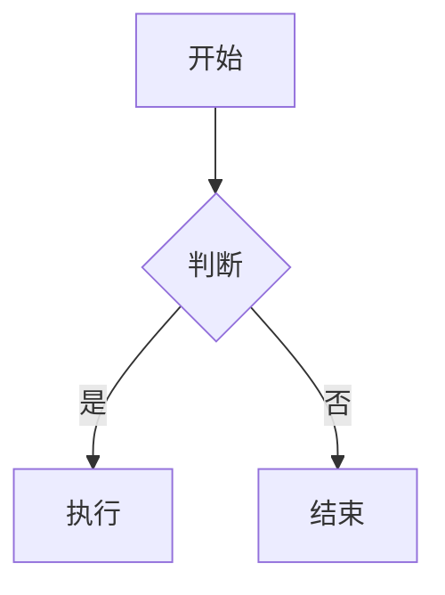

# Markdown 格式协议深度研究

## 一、协议概述

### 1.1 历史演进

| 阶段 | 时间 | 说明 |
|------|------|------|
| 原始 Markdown | 2004 | John Gruber 创建，用于将文本转换为 HTML |
| CommonMark | 2014 | 标准化版本，解决原始规范歧义问题 |
| GFM | 2017 | GitHub 扩展版本，成为事实标准 |
| Markdown IT / Math | 2022+ | 数学公式、更多扩展支持 |

### 1.2 协议层级关系

```
原始 Markdown (2004)
       ↓
CommonMark (2014) - 核心规范
       ↓
GFM (2017) - CommonMark + 表格/任务列表/删除线/自动链接
       ↓
扩展 Markdown - 数学公式/图表/脚注/高亮等
```

---

## 二、CommonMark 核心规范

### 2.1 块级元素 (Block Elements)

#### 2.1.1 标题 (Headings)

**语法：**
```markdown
# 一级标题
## 二级标题
### 三级标题
#### 四级标题
##### 五级标题
###### 六级标题

一级标题
========

二级标题
--------
```

**规范要点：**
- `#` 后必须有空格
- 支持 1-6 级标题
- Setext 风格（下划线）只支持 1-2 级
- ATX 风格（`#`）可闭合（`# 标题 #`）

**渲染效果：** 转换为 `<h1>` 到 `<h6>` HTML 标签

---

#### 2.1.2 段落 (Paragraphs)

**语法：**
```markdown
这是第一段。

这是第二段。
```

**规范要点：**
- 一个或多个空行分隔段落
- 单个换行符不产生新段落
- 段落内连续空格会被压缩

**渲染效果：** 转换为 `<p>` 标签

---

#### 2.1.3 引用块 (Block Quotes)

**语法：**
```markdown
> 这是一级引用
>
> > 这是嵌套引用
>
> 回到一级引用
```

**规范要点：**
- `>` 后可省略空格
- 支持多层嵌套
- 可包含其他块级元素

**渲染效果：** 转换为 `<blockquote>` 标签

---

#### 2.1.4 列表 (Lists)

**无序列表：**
```markdown
- 项目一
- 项目二
  - 嵌套项目
* 也可以用星号
+ 或加号
```

**有序列表：**
```markdown
1. 第一项
2. 第二项
   1. 嵌套项
5. 数字不需要连续（渲染时自动递增）
```

**规范要点：**
- 无序列表可用 `-`、`*`、`+`
- 有序列表数字后跟 `.` 或 `)`
- 嵌套需要 2-4 空格缩进
- 列表项间空行产生 `<p>` 包装

**渲染效果：**
- 无序列表：`<ul>` + `<li>`
- 有序列表：`<ol>` + `<li>`

---

#### 2.1.5 代码块 (Code Blocks)

**Fenced 风格：**
```markdown
```javascript
function hello() {
  console.log("Hello");
}
```
```

**缩进风格：**
```markdown
    缩进4个空格
    形成代码块
```

**规范要点：**
- Fenced 使用 3 个或更多反引号
- 可指定语言标识符
- 缩进风格需要 4 空格或 1 Tab

**渲染效果：**
- 转换为 `<pre><code>`
- 语言标识符通常作为 class

---

#### 2.1.6 分隔线 (Thematic Breaks)

**语法：**
```markdown
---

***

___

* * *
```

**规范要点：**
- 3 个或更多 `-`、`*`、`_`
- 可包含空格
- 不能有其他字符

**渲染效果：** 转换为 `<hr>` 标签

---

### 2.2 行内元素 (Inline Elements)

#### 2.2.1 强调 (Emphasis)

**语法：**
```markdown
*斜体* 或 _斜体_
**粗体** 或 __粗体__
***粗斜体*** 或 ___粗斜体___
```

**规范要点：**
- `*` 和 `_` 效果相同
- 不能用空格分隔
- 可以嵌套

**渲染效果：**
- 斜体：`<em>`
- 粗体：`<strong>`

---

#### 2.2.2 行内代码 (Inline Code)

**语法：**
```markdown
`code`
``包含反引号 ` 的代码``
```

**规范要点：**
- 单反引号包裹
- 内含反引号时用双反引号
- 空格分隔内部反引号

**渲染效果：** 转换为 `<code>` 标签

---

#### 2.2.3 链接 (Links)

**行内链接：**
```markdown
[链接文字](https://example.com "标题")
```

**引用链接：**
```markdown
[链接文字][ref]

[ref]: https://example.com "标题"
```

**自动链接：**
```markdown
<https://example.com>
<email@example.com>
```

**规范要点：**
- 方括号包裹文字
- 圆括号包裹 URL
- 可选标题用双引号
- 引用定义可放文档任意位置

**渲染效果：** 转换为 `<a href="...">` 标签

---

#### 2.2.4 图片 (Images)

**语法：**
```markdown


![替代文字][ref]

[ref]: image.png "标题"
```

**规范要点：**
- 与链接语法类似，前面加 `!`
- 替代文字用于无障碍访问
- 不支持尺寸调整（需 HTML）

**渲染效果：** 转换为 `` 标签

---

## 三、GFM 扩展规范

### 3.1 表格 (Tables)

**语法：**
```markdown
| 左对齐 | 居中 | 右对齐 |
| :--- | :---: | ---: |
| 内容 | 内容 | 内容 |
| 长内容 | 长内容 | 长内容 |
```

**规范要点：**
- 分隔行定义对齐方式
- `:---` 左对齐，`:---:` 居中，`---:` 右对齐
- 列数不需要对齐（自动填充/截断）
- 单元格内支持行内格式

**渲染效果：**
```html
<table>
  <thead><tr><th align="left">...</th></tr></thead>
  <tbody><tr><td align="left">...</td></tr></tbody>
</table>
```

**编辑器能力边界：**
- ✅ 基础表格渲染
- ✅ 对齐支持
- ❌ 单元格合并（需要 HTML）
- ❌ 复杂表格布局

---

### 3.2 任务列表 (Task Lists)

**语法：**
```markdown
- [x] 已完成任务
- [ ] 未完成任务
- [x] 支持嵌套
  - [ ] 子任务
```

**规范要点：**
- 在列表项内使用 `[ ]` 或 `[x]`
- `x` 大小写不敏感
- 可嵌套

**渲染效果：**
```html
<ul>
  <li><input type="checkbox" checked disabled> 已完成</li>
  <li><input type="checkbox" disabled> 未完成</li>
</ul>
```

**编辑器能力边界：**
- ✅ 渲染复选框
- ✅ 显示完成状态
- ⚠️ 交互式勾选（需要额外实现）

---

### 3.3 删除线 (Strikethrough)

**语法：**
```markdown
~~删除的内容~~
```

**规范要点：**
- 两个波浪号包裹
- 必须紧贴内容

**渲染效果：** 转换为 `<del>` 或 `<s>` 标签

---

### 3.4 自动链接 (Autolinks)

**语法：**
```markdown
https://example.com
www.example.com
user@example.com
```

**规范要点：**
- 无需尖括号
- URL 和邮箱自动识别
- GitHub 扩展支持 @mentions 和 #issue

**渲染效果：** 自动转换为 `<a>` 标签

---

## 四、扩展语法（非标准但广泛支持）

### 4.1 数学公式 (Math/LaTeX)

**语法：**
```markdown
行内公式：$E = mc^2$

块级公式：
$$
\sum_{i=1}^{n} x_i = x_1 + x_2 + ... + x_n
$$
```

**规范要点：**
- 行内用单 `$`
- 块级用双 `$$`
- 使用 LaTeX 语法

**渲染效果：**
- 通常通过 MathJax 或 KaTeX 渲染
- 转换为 HTML/CSS 或 SVG

**编辑器能力边界：**
- ✅ 基础公式渲染
- ⚠️ 复杂 LaTeX 可能不支持
- ❌ 某些 LaTeX 宏包不可用

---

### 4.2 脚注 (Footnotes)

**语法：**
```markdown
正文内容[^1]。

[^1]: 这是脚注内容。
```

**规范要点：**
- `[^标识符]` 引用
- `[^标识符]:` 定义
- 标识符可以是数字或文字

**渲染效果：**
- 生成可点击的引用链接
- 页脚显示脚注内容

**编辑器能力边界：**
- ⚠️ 非所有解析器支持
- ⚠️ WYSIWYG 编辑体验有限

---

### 4.3 高亮标记 (Highlight/Mark)

**语法：**
```markdown
==高亮文字==
```

**规范要点：**
- 双等号包裹
- 非标准语法

**渲染效果：** 转换为 `<mark>` 标签

---

### 4.4 上标与下标

**语法：**
```markdown
H~2~O 水分子
X^2^ 平方
```

**规范要点：**
- `~` 包裹下标
- `^` 包裹上标
- 非标准语法

**渲染效果：**
- 下标：`<sub>`
- 上标：`<sup>`

---

### 4.5 定义列表 (Definition Lists)

**语法：**
```markdown
术语
: 定义内容

术语二
: 定义一
: 定义二
```

**规范要点：**
- PHP Markdown Extra 扩展
- 冒号 + 空格开头

**渲染效果：** 转换为 `<dl>`、`<dt>`、`<dd>`

---

### 4.6 图表 (Diagrams/Mermaid)

**语法：**
```markdown

```

**支持类型：**
- 流程图 (flowchart)
- 时序图 (sequence diagram)
- 甘特图 (Gantt chart)
- 饼图 (pie chart)
- 状态图 (state diagram)

**编辑器能力边界：**
- ⚠️ 需要 Mermaid.js 支持
- ⚠️ WYSIWYG 编辑困难
- ✅ 渲染预览可行

---

## 五、编辑器实现能力矩阵

### 5.1 WYSIWYG 编辑能力评估

| 语法 | 渲染 | 直接编辑 | 格式化按钮 | 难度 |
|------|:----:|:--------:|:----------:|:----:|
| 标题 | ✅ | ✅ | ✅ | 低 |
| 粗体/斜体 | ✅ | ✅ | ✅ | 低 |
| 删除线 | ✅ | ✅ | ✅ | 低 |
| 行内代码 | ✅ | ✅ | ✅ | 低 |
| 代码块 | ✅ | ⚠️ | ✅ | 中 |
| 链接 | ✅ | ✅ | ✅ | 低 |
| 图片 | ✅ | ⚠️ | ✅ | 中 |
| 列表 | ✅ | ✅ | ✅ | 低 |
| 引用 | ✅ | ✅ | ✅ | 低 |
| 表格 | ✅ | ⚠️ | ✅ | 中 |
| 任务列表 | ✅ | ⚠️ | ✅ | 中 |
| 分隔线 | ✅ | ✅ | ✅ | 低 |
| 数学公式 | ✅ | ⚠️ | ✅ | 高 |
| 高亮 | ✅ | ✅ | ✅ | 低 |
| 上标/下标 | ✅ | ✅ | ✅ | 低 |
| 脚注 | ⚠️ | ❌ | ❌ | 高 |
| 图表 | ⚠️ | ❌ | ❌ | 高 |

### 5.2 技术限制分析

| 限制类型 | 描述 |
|----------|------|
| **HTML 安全** | 出于安全考虑，不直接支持内嵌 HTML |
| **复杂嵌套** | 深层嵌套结构编辑体验差 |
| **自定义块** | 需要开发自定义 ProseMirror 节点 |
| **实时预览** | 部分语法（如 Mermaid）需要异步渲染 |
| **格式保真** | 某些 Markdown 变体语法会丢失 |

---

## 六、最佳实践建议

### 6.1 文档编写

1. **保持简洁**：避免过度嵌套
2. **统一风格**：选择一种列表标记（推荐 `-`）
3. **适当空行**：提高可读性
4. **图片优化**：压缩后再插入

### 6.2 编辑器开发

1. **核心优先**：先实现 CommonMark 完整支持
2. **渐进增强**：按需添加 GFM 扩展
3. **性能优化**：大文档虚拟滚动
4. **降级方案**：复杂语法回退到源码编辑

---

## 参考资源

- [CommonMark 规范](https://spec.commonmark.org/)
- [GFM 规范](https://github.github.com/gfm/)
- [Markdown Guide](https://www.markdownguide.org/)
- [LaTeX 数学公式参考](https://katex.org/docs/supported.html)
