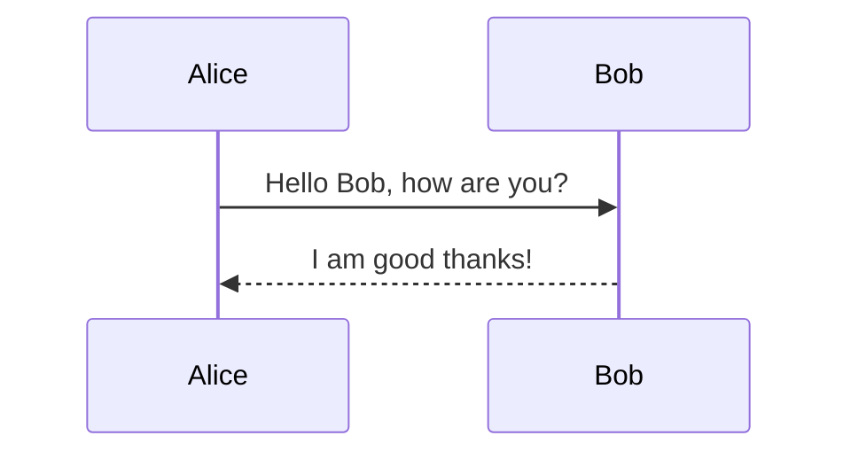
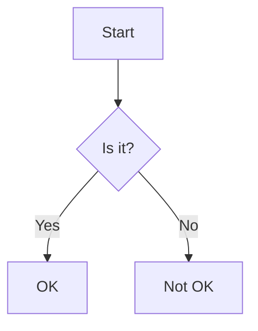

```mermaid
sequenceDiagram
  participant A as Alice
  participant B as Bob
  A->>B: Hello Bob, how are you?
  B-->>A: I am good thanks!
```

```mermaid
flowchart TD
  A[Start] --> B{Is it?}
  B -->|Yes| C[OK]
  B -->|No| D[Not OK]
```

