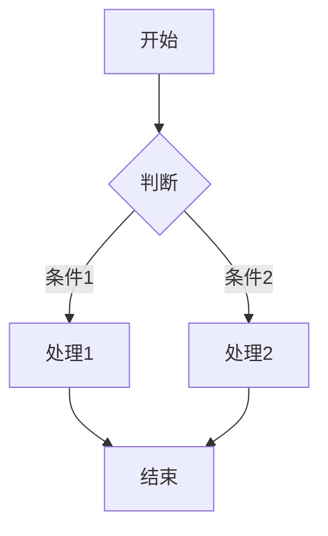
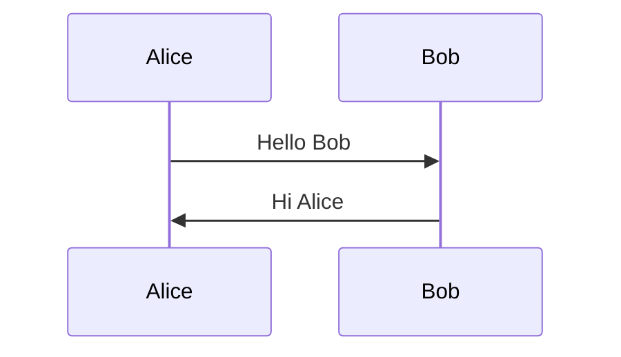
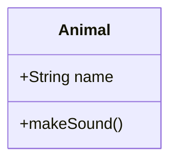

# MOD-005: Diagram Support 图表支持模块

## 文档信息
- **项目名称**: Markly - CodeMirror 6 Markdown Editor
- **文档编号**: MOD-005
- **版本**: v1.0
- **更新日期**: 2026-03-18
- **对应PRD**: docs/v4/01-prd.md

---

## 目录

1. [系统定位](#系统定位)
2. [对应PRD](#对应prd)
3. [全局架构位置](#全局架构位置)
4. [依赖关系](#依赖关系)
5. [核心设计](#核心设计)
6. [接口定义](#接口定义)
7. [数据结构](#数据结构)
8. [边界条件](#边界条件)
9. [实现文件](#实现文件)
10. [覆盖映射](#覆盖映射)

---

## 系统定位

### 在整体架构中的位置

**所属层次**: L5 - 渲染装饰层

**架构定位图**:
```
┌─────────────────────────────────────────────────────┐
│              L6: Toolbar (工具栏)                    │
│         插入图表按钮                                  │
└─────────────────────┬───────────────────────────────┘
                      │ 调用
                      ▼
┌─────────────────────────────────────────────────────┐
│              ★ MOD-005: Diagram Support ★           │
│              图表支持模块                             │
│  ┌─────────────────────────────────────────────┐   │
│  │  • diagramDecorator.ts - 图表装饰器          │   │
│  │  • DiagramRenderer.vue - 图表渲染组件        │   │
│  │  • Mermaid 集成                              │   │
│  │  • 流程图/时序图/类图等                       │   │
│  └─────────────────────────────────────────────┘   │
└─────────────────────┬───────────────────────────────┘
                      │ Decoration
                      ▼
┌─────────────────────────────────────────────────────┐
│              L3: MOD-001 Editor Core                │
│              应用图表装饰器到编辑器                    │
└─────────────────────────────────────────────────────┘
```

### 核心职责

- **语法解析**: 识别 Mermaid 代码块语法
- **图表渲染**: 使用 Mermaid 将文本转换为 SVG 图表
- **实时预览**: 即时渲染图表定义
- **错误处理**: 处理图表语法错误

### 边界说明

- **负责**:
  - Mermaid 语法识别
  - 图表渲染和显示
  - 渲染错误处理
  - 图表样式定制

- **不负责**:
  - 图表编辑器 UI（L6 负责）
  - 图表导出功能
  - 其他图表库支持（如 PlantUML）

---

## 对应PRD

| PRD章节 | 编号 | 内容 |
|---------|-----|------|
| 功能需求 | FR-006 | 图表支持 |
| 用户故事 | US-005 | 数学公式（含图表） |
| 验收标准 | AC-005-05~06 | 图表相关 |

---

## 全局架构位置

```
┌─────────────────────────────────────────────────────────────────────────┐
│                         图表模块架构位置                                 │
├─────────────────────────────────────────────────────────────────────────┤
│                                                                         │
│   ┌─────────────────────────────────────────────────────────────────┐  │
│   │ L6: Toolbar                                                      │  │
│   │  insertMermaid() → 插入 ```mermaid 代码块                        │  │
│   └────────────────────────────────┬────────────────────────────────┘  │
│                                    │                                  │
│                                    ▼                                   │
│   ┌─────────────────────────────────────────────────────────────────┐  │
│   │ ★ MOD-005: Diagram Support                                      │  │
│   │  decorators/diagramDecorator.ts                                 │  │
│   │  • 识别 ```mermaid 代码块                                        │  │
│   │  • 创建 Widget Decoration                                        │  │
│   │  • 调用 Mermaid 渲染                                             │  │
│   │  components/DiagramRenderer.vue                                 │  │
│   │  • 封装 Mermaid 渲染逻辑                                         │  │
│   │  • 错误边界处理                                                  │  │
│   └────────────────────────────────┬────────────────────────────────┘  │
│                                    │ Decoration.widget()              │
│                                    ▼                                   │
│   ┌─────────────────────────────────────────────────────────────────┐  │
│   │ L3: Editor Core                                                  │  │
│   │  • EditorView 显示渲染后的图表                                    │  │
│   └─────────────────────────────────────────────────────────────────┘  │
│                                                                         │
└─────────────────────────────────────────────────────────────────────────┘
```

---

## 依赖关系

### 上游依赖

| 模块名称 | 模块编号 | 依赖原因 | 调用方式 |
|---------|---------|---------|---------|
| Editor Core | MOD-001 | 应用装饰器 | Extension |
| Mermaid | npm | 图表渲染 | import |

### 下游依赖

| 模块名称 | 模块编号 | 被调用场景 | 调用方式 |
|---------|---------|-----------|---------|
| Decorator System | MOD-003 | 图表装饰器注册 | diagramDecorator |
| Toolbar | MOD-007 | 插入图表 | insertMermaid |

---

## 核心设计

### Mermaid 语法

````markdown





````

### 装饰器实现

```typescript
// decorators/diagramDecorator.ts

import { ViewPlugin, ViewUpdate, Decoration, DecorationSet } from '@codemirror/view';
import { syntaxTree } from '@codemirror/language';
import { Range } from '@codemirror/state';
import mermaid from 'mermaid';

export interface DiagramDecoratorOptions {
  theme?: 'default' | 'dark' | 'forest' | 'neutral';
  securityLevel?: 'strict' | 'loose' | 'antiscript';
}

// 图表装饰器
export const diagramDecorator = (options: DiagramDecoratorOptions = {}) => {
  const { theme = 'default', securityLevel = 'strict' } = options;

  // 初始化 Mermaid
  mermaid.initialize({
    theme,
    securityLevel,
    startOnLoad: false,
  });

  return ViewPlugin.fromClass(
    class {
      decorations: DecorationSet = Decoration.none;

      constructor(view: EditorView) {
        this.decorations = this.computeDecorations(view);
      }

      update(update: ViewUpdate) {
        if (update.docChanged || update.viewportChanged) {
          this.decorations = this.computeDecorations(update.view);
        }
      }

      computeDecorations(view: EditorView): DecorationSet {
        const decorations: Range<Decoration>[] = [];
        const { from, to } = view.viewport;

        // 遍历语法树查找 Mermaid 代码块
        syntaxTree(view.state).iterate({
          from,
          to,
          enter: (node) => {
            // 查找 FencedCode 节点
            if (node.type.name === 'FencedCode') {
              const nodeText = view.state.doc.sliceString(node.from, node.to);
              const info = this.getCodeBlockInfo(nodeText);

              if (info.language === 'mermaid') {
                const deco = this.createDiagramDecoration(info.code);
                if (deco) {
                  decorations.push(deco.range(node.from, node.to));
                }
              }
            }
          },
        });

        return Decoration.set(decorations);
      }

      // 解析代码块信息
      getCodeBlockInfo(text: string): { language: string; code: string } {
        const match = text.match(/^```(\w+)?\n?([\s\S]*?)```$/);
        if (!match) {
          return { language: '', code: text };
        }
        return {
          language: match[1] || '',
          code: match[2].trim(),
        };
      }

      // 创建图表装饰
      createDiagramDecoration(code: string): Decoration | null {
        const id = `mermaid-${Date.now()}-${Math.random().toString(36).substr(2, 9)}`;

        try {
          // 创建容器
          const container = document.createElement('div');
          container.className = 'cm-diagram';
          container.id = id;

          // 异步渲染
          this.renderDiagram(code, id, container);

          return Decoration.replace({
            widget: new DiagramWidget(container),
            inclusive: false,
            block: true,
          });
        } catch (error) {
          // 渲染失败
          const errorContainer = document.createElement('div');
          errorContainer.className = 'cm-diagram cm-diagram-error';
          errorContainer.textContent = '图表渲染失败';
          errorContainer.title = error instanceof Error ? error.message : '未知错误';

          return Decoration.replace({
            widget: new DiagramWidget(errorContainer),
            inclusive: false,
            block: true,
          });
        }
      }

      // 渲染图表
      async renderDiagram(code: string, id: string, container: HTMLElement): Promise<void> {
        try {
          const { svg } = await mermaid.render(id, code);
          container.innerHTML = svg;
        } catch (error) {
          container.classList.add('cm-diagram-error');
          container.textContent = '图表语法错误';
          container.title = error instanceof Error ? error.message : '渲染失败';
        }
      }
    },
    {
      decorations: (v) => v.decorations,
    }
  );
};

// 图表 Widget
class DiagramWidget extends WidgetType {
  constructor(private dom: HTMLElement) {
    super();
  }

  toDOM(): HTMLElement {
    return this.dom;
  }

  eq(other: DiagramWidget): boolean {
    return other.dom.innerHTML === this.dom.innerHTML;
  }

  ignoreEvent(): boolean {
    return false;
  }
}
```

### DiagramRenderer 组件

```vue
<!-- components/DiagramRenderer.vue -->
<template>
  <div
    ref="containerRef"
    class="diagram-renderer"
    :class="{ 'diagram-error': hasError }"
    v-html="renderedSvg"
  />
</template>

<script setup lang="ts">
import { ref, computed, onMounted, watch } from 'vue';
import mermaid from 'mermaid';

interface Props {
  code: string;                    // Mermaid 代码
  theme?: 'default' | 'dark' | 'forest' | 'neutral';
}

const props = withDefaults(defineProps<Props>(), {
  theme: 'default',
});

const containerRef = ref<HTMLElement>();
const hasError = ref(false);
const renderedSvg = ref('');

// 初始化 Mermaid
onMounted(() => {
  mermaid.initialize({
    theme: props.theme,
    securityLevel: 'strict',
    startOnLoad: false,
  });

  renderDiagram();
});

// 监听代码变化
watch(() => props.code, renderDiagram);

const renderDiagram = async () => {
  if (!props.code.trim()) {
    renderedSvg.value = '';
    return;
  }

  try {
    hasError.value = false;
    const id = `diagram-${Date.now()}`;
    const { svg } = await mermaid.render(id, props.code);
    renderedSvg.value = svg;
  } catch (error) {
    hasError.value = true;
    renderedSvg.value = `<div class="diagram-error-message">
      <span>⚠️ 图表语法错误</span>
    </div>`;
  }
};
</script>

<style scoped>
.diagram-renderer {
  display: flex;
  justify-content: center;
  padding: 16px;
  background: var(--markly-surface);
  border-radius: 4px;
  overflow-x: auto;
}

.diagram-renderer.diagram-error {
  background: var(--markly-error-bg, #ffebee);
  border: 1px solid var(--markly-error, #cc0000);
}

.diagram-error-message {
  color: var(--markly-error, #cc0000);
  padding: 8px 16px;
}

/* Mermaid SVG 样式覆盖 */
.diagram-renderer :deep(svg) {
  max-width: 100%;
  height: auto;
}
</style>
```

### Mermaid 配置

```typescript
// config/mermaid.ts

import mermaid from 'mermaid';

export interface MermaidConfig {
  theme: 'default' | 'dark' | 'forest' | 'neutral' | 'base';
  securityLevel: 'strict' | 'loose' | 'antiscript';
  flowchart: {
    useMaxWidth: boolean;
    htmlLabels: boolean;
    curve: 'basis' | 'linear' | 'cardinal';
  };
  sequence: {
    useMaxWidth: boolean;
    diagramMarginX: number;
    diagramMarginY: number;
  };
  gantt: {
    useMaxWidth: boolean;
    leftPadding: number;
  };
}

export const defaultMermaidConfig: MermaidConfig = {
  theme: 'default',
  securityLevel: 'strict',
  flowchart: {
    useMaxWidth: true,
    htmlLabels: true,
    curve: 'basis',
  },
  sequence: {
    useMaxWidth: true,
    diagramMarginX: 50,
    diagramMarginY: 10,
  },
  gantt: {
    useMaxWidth: true,
    leftPadding: 75,
  },
};

// 根据编辑器主题获取 Mermaid 主题
export const getMermaidTheme = (editorTheme: 'light' | 'dark'): string => {
  return editorTheme === 'dark' ? 'dark' : 'default';
};

// 初始化 Mermaid
export const initMermaid = (config: Partial<MermaidConfig> = {}) => {
  mermaid.initialize({
    ...defaultMermaidConfig,
    ...config,
  });
};
```

---

## 接口定义

### 对外接口清单

| 接口编号 | 接口名称 | 类型 | 路径 | 对应PRD |
|---------|---------|------|------|---------|
| API-016 | diagramDecorator | Decorator | decorators/diagramDecorator.ts | FR-006 |
| API-017 | DiagramRenderer | Component | components/DiagramRenderer.vue | FR-006 |
| API-018 | insertMermaid | Method | useToolbar.insertMermaid | FR-006 |

### 接口详细定义

#### API-016: diagramDecorator

**对应PRD**: FR-006

**接口定义**:
```typescript
interface DiagramDecoratorOptions {
  theme?: 'default' | 'dark' | 'forest' | 'neutral';
  securityLevel?: 'strict' | 'loose' | 'antiscript';
}

function diagramDecorator(options?: DiagramDecoratorOptions): Extension;
```

---

## 数据结构

### DATA-007: DiagramConfig

**对应PRD**: Entity-002 (DocumentConfig 中的图表配置)

```typescript
interface DiagramConfig {
  enabled: boolean;         // 是否启用图表
  theme: 'default' | 'dark' | 'forest' | 'neutral';
  supportedTypes: string[]; // 支持的图表类型
}

// 支持的图表类型
const SUPPORTED_DIAGRAM_TYPES = [
  'flowchart',      // 流程图
  'sequence',       // 时序图
  'class',          // 类图
  'state',          // 状态图
  'er',             // ER 图
  'gantt',          // 甘特图
  'pie',            // 饼图
  'gitgraph',       // Git 图
] as const;
```

---

## 边界条件

### BOUND-027: 无效 Mermaid 语法

**对应PRD**: AC-005-05

**边界描述**:
- 输入无效的 Mermaid 语法时应显示错误提示

**处理逻辑**:
```typescript
try {
  const { svg } = await mermaid.render(id, code);
  container.innerHTML = svg;
} catch (error) {
  container.classList.add('cm-diagram-error');
  container.textContent = '图表语法错误';
  container.title = error.message;
}
```

### BOUND-028: 大型图表渲染

**对应PRD**: AC-005-06

**边界描述**:
- 大型图表可能影响性能

**处理逻辑**:
```typescript
// 限制代码长度
const MAX_DIAGRAM_SIZE = 5000;

if (code.length > MAX_DIAGRAM_SIZE) {
  return Decoration.replace({
    widget: new OversizedDiagramWidget(code.length),
  });
}
```

### BOUND-029: 图表点击编辑

**对应PRD**: AC-005-05

**边界描述**:
- 点击图表应进入编辑模式

**处理逻辑**:
```typescript
container.addEventListener('click', (e) => {
  e.preventDefault();
  // 找到原始代码块位置
  const pos = view.posAtDOM(container);
  view.dispatch({
    selection: { anchor: node.from, head: node.to },
  });
  view.focus();
});
```

---

## 实现文件

| 文件路径 | 职责 |
|---------|------|
| decorators/diagramDecorator.ts | 图表装饰器 |
| components/DiagramRenderer.vue | 图表渲染组件 |
| config/mermaid.ts | Mermaid 配置 |

---

## 覆盖映射

### PRD需求覆盖情况

| PRD类型 | PRD编号 | 架构元素 | 覆盖状态 |
|---------|---------|---------|---------|
| 功能需求 | FR-006 | diagramDecorator | ✅ |
| 用户故事 | US-005 | API-016~018 | ✅ |
| 验收标准 | AC-005-05 | 语法错误处理 | ✅ |
| 验收标准 | AC-005-06 | 性能优化 | ✅ |

---

## 变更历史

| 版本 | 日期 | 变更内容 | 作者 |
|-----|------|---------|------|
| 1.0 | 2026-03-18 | 初始版本 | AI |
