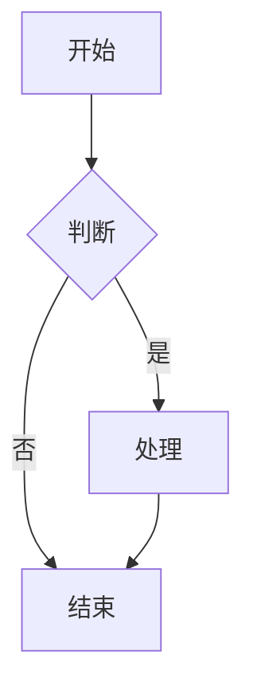
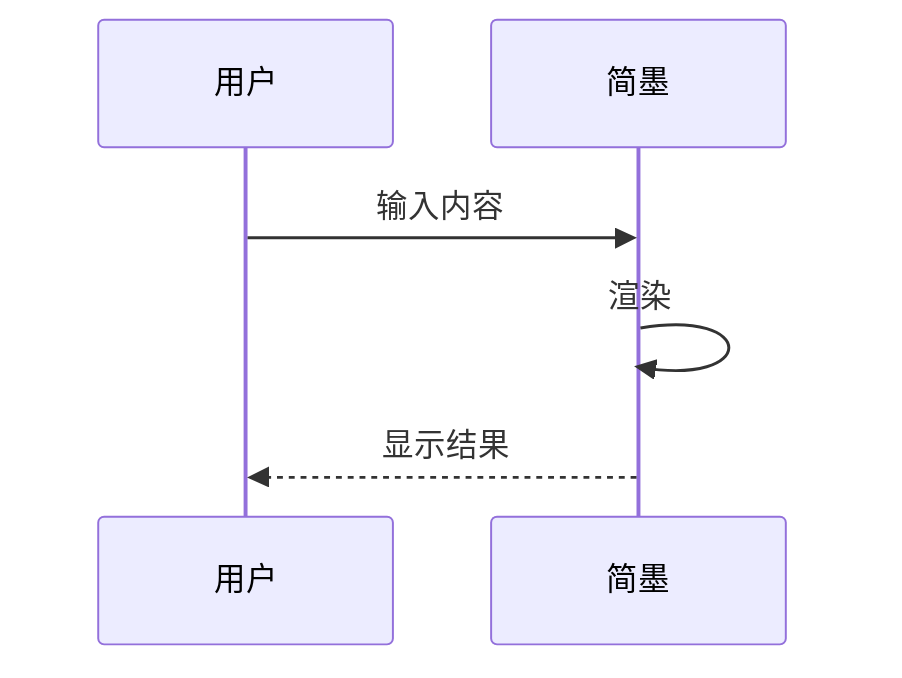
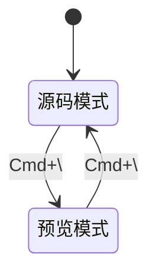

# 简墨测试文档

这是一个包含各种元素的测试文档。

## 1. 数学公式

### 行内公式
这是行内公式 $E = mc^2$，以及 $\int_{a}^{b} f(x) dx$。

### 块级公式
$$
f(x) = \int_{-\infty}^{\infty} \hat f(\xi) e^{2\pi i \xi x} d\xi
$$

## 2. 代码高亮

### JavaScript
```javascript
function hello() {
  console.log("Hello, World!");
  return {
    name: "简墨",
    version: "0.1.0"
  };
}
```

### Python
```python
def fibonacci(n):
    if n <= 1:
        return n
    return fibonacci(n-1) + fibonacci(n-2)

print(fibonacci(10))
```

### Rust
```rust
fn main() {
    let numbers: Vec<i32> = (1..=10).collect();
    println!("{:?}", numbers);
}
```

## 3. Mermaid 图表

### 流程图


### 时序图


### 状态图


## 4. 表格

| 功能 | 状态 | 说明 |
|------|------|------|
| 公式 | ✅ | KaTeX 渲染 |
| 代码 | ✅ | Shiki 高亮 |
| 图表 | ✅ | Mermaid 渲染 |
| 图片 | ✅ | 预览弹窗 |

## 5. 列表

### 无序列表
- 第一项
- 第二项
  - 子项 A
  - 子项 B
- 第三项

### 有序列表
1. 第一步
2. 第二步
3. 第三步

## 6. 引用

> 这是一个引用块
> 可以用来标注重要内容

## 7. 脚注

这里有一个脚注[^1]，点击可以跳转。

[^1]: 这是脚注的内容。

## 8. 图片


---

*文档结束*
